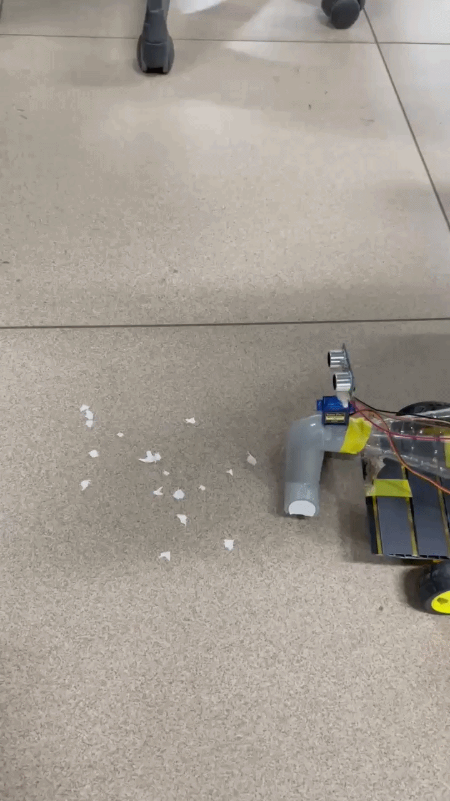

# 🧹 Arduino-Based Automatic Vacuum Cleaner

## 📖 Overview

The Arduino-Based Automatic Vacuum Cleaner is a prototype robotics project developed for academic and learning purposes to demonstrate autonomous cleaning using embedded systems, sensor integration, and motor control. The robot is capable of moving independently, detecting obstacles, and changing its direction without human intervention.

The system uses an Arduino Uno as the main controller, an ultrasonic sensor for obstacle detection, and a fan-based suction mechanism for dust collection. The project showcases the practical application of robotics, automation, and embedded systems concepts through a low-cost working prototype.

---

## ✨ Features

- Autonomous navigation without manual control
- Obstacle detection and avoidance using ultrasonic sensing
- Arduino-based embedded control system
- Fan-powered dust collection mechanism
- Compact and budget-friendly design
- Demonstrates robotics and automation concepts

---

## 🔧 Components Used

- Arduino Uno
- HC-SR04 Ultrasonic Sensor
- Servo Motor
- 4 DC Motors 
- Arduino Motor Shield
- Battery Pack
- Fan Blade
- Connecting Wires
- Plastic Bottle Dust Collector
- Robot Chassis and Wheels

---

## ⚙️ Working Principle

The ultrasonic sensor continuously scans the surroundings and measures the distance between the robot and nearby obstacles. When an obstacle is detected, the Arduino processes the sensor data and commands the motors to change direction, preventing collisions.

A fan blade attached to the cleaning mechanism creates suction inside a plastic bottle-based dust collection system, allowing the robot to collect lightweight dust particles while navigating the environment autonomously.

---

## 📸 Project Gallery

### Robot Prototype

### Circuit Diagram

---

## 🎥 Demonstration

---

## 🚀 Future Enhancements

- Gesture-based control system
- Mobile application integration
- Improved navigation and path planning
- Automatic charging dock
- Enhanced obstacle detection using additional sensors

---

## 🎯 Learning Outcomes

Through this project, I gained practical experience in:

- Embedded Systems
- Arduino Programming
- Sensor Integration
- Motor Control
- Robotics Fundamentals
- Autonomous Navigation

---

## 📌 Project Type

Academic Prototype Project developed to demonstrate the practical implementation of robotics, automation, embedded systems, sensor integration, and autonomous navigation concepts.